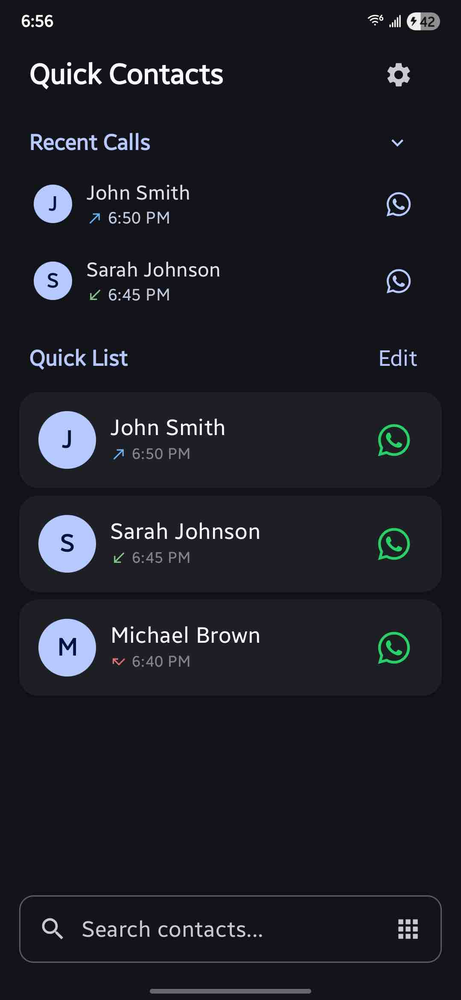

# Quick Contacts

A fast and privacy-focused Android app for quick access to your most important contacts and recent calls.

## Features

- **Quick Contact List**: Add your most important contacts for instant access
- **Recent Calls**: View and redial your recent calls (GitHub release only)
- **Direct Actions**: Call, message, or open messaging apps (WhatsApp, Telegram, Signal, SMS) with one tap
- **Audio & Video Calls**: Start audio and video calls directly in all supported apps
- **Search**: Quickly find any contact in your phonebook by name or phone number
- **Customizable Actions**: Set different actions for each contact
- **Refreshed Settings**: Updated settings screen for a cleaner, more intuitive experience
- **Offline Operation**: Works entirely offline - no internet required

## Screenshots

| Homescreen | All Options | Tap Actions | Settings |
|------------|-------------|-------------|----------|
|  |  |  |  |

## Privacy-First Design

Quick Contacts is built with your privacy in mind:

- **Local Storage Only**: All data stays on your device
- **No Internet Access**: No data is sent to external servers
- **No Tracking**: No analytics or usage tracking
- **Transparent Permissions**: Only requests necessary permissions

### Permissions Used

- **Contacts Access**: To display and search your contacts
- **Phone Access**: To make calls directly from the app
- **Call History** (Optional): To show recent calls for quick access

## Installation

1. Download the APK file
2. Enable "Install from Unknown Sources" in your device settings
3. Install the app
4. Grant the requested permissions when prompted

## Usage

### Adding Contacts to Quick List
1. Tap the search icon
2. Search for a contact by name or phone number
3. Tap the "+" button to add them to your quick list

### Customizing Actions
1. Tap "Edit" in the quick list
2. Tap on a contact to customize their actions
3. Choose primary and secondary actions

### Recent Calls
- Recent calls appear at the top of the main screen
- Tap any recent call to redial
- Call types are color-coded (incoming, outgoing, missed)
- Note: Recent calls is currently exclusive to the GitHub release build

## Privacy Policy

We are committed to protecting your privacy. Our complete privacy policy is available in the app and covers:

- Data collection and usage
- Local storage practices
- Permission requirements
- Your rights and choices

**Key Points:**
- All data is stored locally on your device
- No data is transmitted to external servers
- No analytics or tracking
- You control all permissions

For the full privacy policy, see `PRIVACY_POLICY.md` in this repository.

## Support

If you have questions or need support:
- Use the feedback feature in the app
- Check the privacy policy for contact information

## Development Features

### Mock Mode

For demonstration and testing purposes, the app includes a mock mode that provides sample data without requiring real contacts or call permissions.

**To enable mock mode:**
1. Open `app/src/main/java/com/tk/quickcontacts/utils/Mock.kt`
2. Change `Mocks.ENABLE_MOCK_MODE` from `false` to `true`
3. Rebuild and run the app

## License

This project is licensed under the MIT License - see the [LICENSE](LICENSE) file for details.

---

**Note**: This app integrates with third-party messaging apps (WhatsApp, Telegram, SMS). Each messaging app has its own privacy policy and data handling practices. 